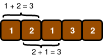

-------

Lily has a chocolate bar consisting of a row of $$n$$ squares where each square has an integer written on it. She wants to share it with Ron for his birthday, which falls on month $$m$$ and day $$d$$. Lily wants to give Ron a piece of chocolate only if it contains $$m$$ consecutive squares whose integers sum to $$d$$.

Given $$m$$, $$d$$, and the sequence of integers written on each square of Lily's chocolate bar, how many different ways can Lily break off a piece of chocolate to give to Ron?

For example, if $$m=2$$, $$d=3$$ and the chocolate bar contains $$n$$ rows of squares with the integers $$[1,2,1,3,2]$$ written on them from left to right, the following diagram shows two ways to break off a piece:

__Input Format__

The first line contains an integer denoting $$n$$ (the number of squares in the chocolate bar).

The second line contains $$n$$ space-separated integers describing the respective values of $$s_{0},s_{1},\ldots,s_{n-1}$$ (the numbers written on each consecutive square of chocolate). 

The third line contains two space-separated integers describing the respective values of $$d$$ (Ron's birth day) and $$m$$ (Ron's birth month).

__Constraints__

$$\cdot \ 1 \le n \le 100$$

$$\cdot \ 1 \le s_{i} \le 5,where(0 \le i \lt n)$$

$$\cdot \ 1 \le d \le 31$$

$$\cdot \ 1 \le m \le 12$$

__Output Format__

Print an integer denoting the total number of ways that Lily can give a piece of chocolate to Ron.

__Sample Input 0__

5

1 2 1 3 2 

3 2

__Sample Output 0__

2

__Explanation 0__

This sample is already explained in the problem statement.

__Sample Input 1__

6

1 1 1 1 1 1

3 2

__Sample Output 1__

0

__Explanation 1__

Lily only wants to give Ron $$m=2$$ consecutive squares of chocolate whose integers sum to $$d=3$$. There are no possible pieces satisfying these constraints:

Thus, we print $$0$$ as our answer.

__Sample Input 2__

1

4

4 1

__Sample Output 2__

1

__Explanation 2__

Lily only wants to give Ron $$m=1$$ square of chocolate with an integer value of $$d=4$$. Because the only square of chocolate in the bar satisfies this constraint, we print $$1$$ as our answer.


#!/bin/python3

import sys

def solve(n, s, d, m):
    # Complete this function
    count = 0
    for i in range(n-m+1):
        sum = 0
        for j in range(m):
            sum += s[i+j]
        if sum == d:
            count += 1
    return count

n = int(input().strip())
s = list(map(int, input().strip().split(' ')))
d, m = input().strip().split(' ')
d, m = [int(d), int(m)]
result = solve(n, s, d, m)
print(result)
    