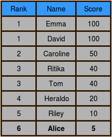

-------

Alice is playing an arcade game and wants to climb to the top of the leaderboard. Can you help her track her ranking as she beats each level? The game uses Dense Ranking, so its leaderboard works like this:

$$\cdot \ $$The player with the highest score is ranked number $$1$$ on the leaderboard.

$$\cdot \ $$Players who have equal scores receive the same ranking number, and the next player(s) receive the immediately following ranking number.

For example, four players have the scores $$100$$, $$90$$, $$90$$, and $$80$$. Those players will have ranks $$1$$, $$2$$, $$2$$, and $$3$$, respectively.

When Alice starts playing, there are already $$n$$ people on the leaderboard. The score of each player $$i$$ is denoted by $$s_{i}$$. Alice plays for $$m$$ levels, and we denote her total score after passing each level $$j$$ as $$alice_{j}$$. After completing each level, Alice wants to know her current rank.

You are given an array, $$scores$$, of monotonically decreasing leaderboard scores, and another array, $$alice$$, of Alice's cumulative scores for each level of the game. You must print $$m$$ integers. The $$j^{th}$$ integer should indicate the current rank of alice after passing the $$j^{th}$$ level.

__Input Format__

The first line contains an integer, $$n$$, denoting the number of players already on the leaderboard. 

The next line contains $$n$$ space-separated integers describing the respective values of $$scores_{0},scores_{1},\ldots,scores_{n-1}$$. 

The next line contains an integer, $$m$$, denoting the number of levels Alice beats. 

The last line contains $$m$$ space-separated integers describing the respective values of $$alice_{0},alice_{1},\ldots,alice_{m-1}$$.

__Constraints__

$$\cdot \ 1 \le n \le 2 \times 10^5$$

$$\cdot \ 1 \le m \le 2 \times 10^5$$

$$\cdot \ 0 \le scores_{i} \le 10^9 \ for \ 0 \le i \lt n$$

$$\cdot \ 0 \le alice_{j} \le 10^9 \ for \ 0 \le j \lt m$$

$$\cdot \ $$ Alice's scores are cumulative, so $$alice$$ is in ascending order.

__subtask__

For $$60\perc$$ of the maximum score:

$$\cdot \ 1 \le n \le 200$$

$$\cdot \ 1 \le m \le 200$$

__Output Format__

Print $$m$$ integers. The $$j^{th}$$ integer should indicate the rank of alice after passing the $$j^{th}$$ level.

__Sample Input 0__

7

100 100 50 40 40 20 10

4

5 25 50 120

__Sample Output 0__

6

4

2

1

__Explanation 0__

Alice starts playing with $$7$$ players already on the leaderboard, which looks like this:

After Alice finishes level $$0$$, her score is $$5$$ and her ranking is $$6$$:

After Alice finishes level $$1$$, her score is $$25$$ and her ranking is $$4$$:

After Alice finishes level $$2$$, her score is $$50$$ and her ranking is tied with Caroline at $$2$$:

After Alice finishes level $$3$$, her score is $$120$$ and her ranking is $$1$$:


    